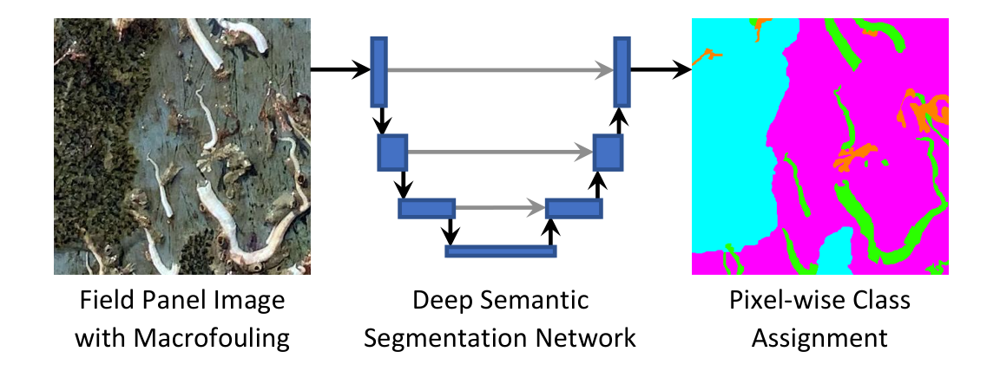

# Semantic Segmentation of Macrofouling Images

This is the official implementation of the paper "[Semantic Segmentation for Fully Automated Macrofouling Analysis on Coatings after Field Exposure](https://arxiv.org/abs/2211.11607)" by Lutz M. K. Krause, Emily Manderfeld, Patricia Gnutt, Louisa Vogler, Ann Wassick, Kailey Richard, Marco Rudolph, Kelli Z. Hunsucker, Geoffrey W. Swain, Bodo Rosenhahn, and Axel Rosenhahn.

<p>
 
</p>

> Biofouling is a major challenge for sustainable shipping, filter membranes, heat exchangers, and medical devices. The development of fouling-resistant coatings requires the evaluation of their effectiveness. Such an evaluation is usually based on the assessment of fouling progression after different exposure times to the target medium (e.g., salt water). The manual assessment of macrofouling requires expert knowledge about local fouling communities due to high variances in phenotypical appearance, has single-image sampling inaccuracies for certain species, and lacks spatial information. Here we present an approach for automatic image-based macrofouling analysis. We created a dataset with dense labels prepared from field panel images and propose a convolutional network (adapted U-Net) for the semantic segmentation of different macrofouling classes. The establishment of macrofouling localization allows for the generation of a successional model which enables the determination of direct surface attachment and in-depth epibiotic studies.

## Getting Started

You will need to install the packages specified in _env.yml_. We recommend setting up a [virtual environment with conda](https://docs.anaconda.com/anaconda/install/) and installing the packages inside it.

Install packages and activate the created `conda` environment with:

    $ conda env create -f env.yml
    $ conda activate macro-seg

If you want to use our model on new data or to verify the validation results, please download the trained models [here](https://biointerfaces.ruhr-uni-bochum.de/deep-learning-research/) and unzip them into `results/models`.

## Data

### Get our annotated dataset

The created dataset with dense segmentation masks utilized in the paper can be found [here](https://biointerfaces.ruhr-uni-bochum.de/deep-learning-research/). Please unzip its content into `data`. It is preprocessed and split so you can continue with [experiments](#run-experiments). Currently, only the validation data is publicly available. If you need more data for your research please contact the authors.
### Prepare your own panel images

For training or inference, you need to preprocess your panel images. Store your JPEG images in `data/panels`, use `python preprocess.py` to obtain the results in `data/cropped`, and proceed with [inference](#predict-segmentation-masks) if you just want to predict segmentation masks. 

For training a model on your own data, use the `--slices` option to generate image patches from panel images which are stored in `data/sliced`.
```
usage: python preprocess.py [-h] [--images_dir IMAGES_DIR] [--dst_dir DST_DIR] [--slices]

optional arguments:
  -h, --help            show this help message and exit
  --images_dir IMAGES_DIR
                        Root directory where the panel images are stored (in subfolders)
  --dst_dir DST_DIR     Destination for the preprocessed images and slices
  --slices              Slice images after preprocessing to patches for training
```
### Prepare image patches for training

For supervised training, you need to create a dataset. Annotate some patches from `data/sliced` with a labeling tool of your choice (e.g., labelbox) considering the classes and colors in `data/colormap.json`. Place annotated images patches and their masks in `data/annotated`. Run `python split_generate.py` for the generation of synthetic samples from your annotated patches, splitting into training and validation set, and oversampling of training patches regarding the class frequency.
```
usage: python split_generate.py [-h] [--data_dir DATA_DIR] [--syn_samples] [--train_val_split] [--aimed_val_ratio AIMED_VAL_RATIO] [--split_epochs SPLIT_EPOCHS] [--oversample_train]

optional arguments:
  -h, --help            show this help message and exit
  --data_dir DATA_DIR   Directory with the 'annotated' patches and 'cropped' panel images
  --syn_samples         Generate synthetic samples from overlapping segmentation masks
  --train_val_split     Split annotated patches into training and validation set
  --aimed_val_ratio AIMED_VAL_RATIO
                        Desired fraction of the validation set
  --split_epochs SPLIT_EPOCHS
                        Evolution epochs of the genetic algorithm for training validation split
  --oversample_train    Oversample training data by class frequency
```
## Run experiments

### Predict segmentation masks

For inference, use `python predict.py` and provide the path to your images with `--data_dir`. Adjust `--batch_size` depending on the size of your GPU's VRAM. Helpful visualization for human analysis are created with `--save_overlay` and `--save_overview`.
```
usage: python predict.py [-h] [--data_dir DATA_DIR] [--results_dir RESULTS_DIR] [--model_path MODEL_PATH] [--batch_size BATCH_SIZE] [--downsample DOWNSAMPLE] [--save_entropies] [--save_overlay] [--save_overview]

optional arguments:
  -h, --help            show this help message and exit
  --data_dir DATA_DIR   Directory with images for inference
  --results_dir RESULTS_DIR
                        Destination for segmentation masks, visualizations, and summarized statistics
  --model_path MODEL_PATH
  --batch_size BATCH_SIZE
  --downsample DOWNSAMPLE
                        Image downsampling factor from model training
  --save_entropies      Save uncertainty map calculated by information entropy of logits
  --save_overlay        Save input overlayed by segmentation mask and visualized statistics
  --save_overview       Save overview image with input, segmentation mask, and visualized statistics
```

### Train your own model

Use `python training.py` and the preprocessed image patches in `data/training` and `data/validation` to train your own model with one of the configurations described in our paper.
```
usage: python training.py [-h] [--config {baseline,pretrained,decoder_links,final}] [--data_dir DATA_DIR] [--results_dir RESULTS_DIR] [--batch_size BATCH_SIZE] [--max_epochs MAX_EPOCHS]

optional arguments:
  -h, --help            show this help message and exit
  --config {baseline,pretrained,decoder_links,final}
                        Configuration for training (cf., paper, Table 1)
  --data_dir DATA_DIR   Directory with training, validation, and visualization image patches
  --results_dir RESULTS_DIR
                        Results directory for trained models
  --batch_size BATCH_SIZE
  --max_epochs MAX_EPOCHS
```

## Analyze results

The `analysis/` directory contains several notebooks for active learning, evaluation, random point error estimation, and reproduction of the figures shown in our publication.

## Citation
Please cite the paper in your publications if it helps your research:

    @artice{Krause2022,
    doi = {10.48550/ARXIV.2211.11607},
    url = {https://arxiv.org/abs/2211.11607},
    author = {Lutz M. K. Krause, Emily Manderfeld, Patricia Gnutt, Louisa Vogler, Ann Wassick, Kailey Richard, Marco Rudolph, Kelli Z. Hunsucker, Geoffrey W. Swain, Bodo Rosenhahn, and Axel Rosenhahn},
    title = {Semantic Segmentation for Fully Automated Macrofouling Analysis on Coatings after Field Exposure},
    publisher = {arXiv},
    year = {2022},
    }

There exists a [published version]() of our journal article and a [preprint version](https://arxiv.org/abs/2211.11607). Notice that changes have been made during peer-review that are not contained in the preprint version.
